# 🐳 Dockerized Node.js Service with GitHub Actions CI/CD

A DevOps project that demonstrates how to **Dockerize a Node.js application** and automatically deploy it to a remote **AWS EC2 server** using **GitHub Actions** and **Docker Hub**.

The project includes:

- Node.js / Express application
- Basic Authentication
- Environment variable management
- Docker containerization
- Docker Hub image registry
- AWS EC2 deployment
- GitHub Actions CI/CD
- GitHub Secrets management
- Automatic deployment on every push to `main`

---

## 🔗 Project Page

This project was completed as part of the roadmap.sh DevOps projects:

**Dockerized Service — roadmap.sh**

https://roadmap.sh/projects/dockerized-service-deployment

---

## 🎯 Project Goal

The goal of this project is to practice a complete container-based deployment workflow:

```text
Developer
    │
    │ git push
    ▼
GitHub Repository
    │
    ▼
GitHub Actions
    │
    ├── Build Docker Image
    │
    ├── Push Docker Image
    │
    ▼
Docker Hub
    │
    │ docker pull
    ▼
AWS EC2
    │
    ▼
Docker Container
    │
    ▼
Node.js Application
```

Every push to the `main` branch automatically builds a new Docker image, pushes it to Docker Hub, connects to the EC2 server, and deploys the new container.

---

# 🛠️ Technologies Used

| Technology | Purpose |
|---|---|
| Node.js | Application runtime |
| Express.js | Web server |
| dotenv | Environment variable management |
| Docker | Application containerization |
| Docker Hub | Docker image registry |
| AWS EC2 | Remote Linux server |
| GitHub | Source code repository |
| GitHub Actions | CI/CD automation |
| SSH | Remote server deployment |
| Ubuntu | EC2 server operating system |

---

# 📁 Project Structure

```text
dockerized-nodejs-service/
│
├── .github/
│   └── workflows/
│       └── deploy.yml
│
├── src/
│   └── server.js
│
├── screenshots/
│
├── .dockerignore
├── .env.example
├── .gitignore
├── Dockerfile
├── package.json
├── package-lock.json
└── README.md
```

The real `.env` file is intentionally excluded from Git and Docker.

---

# 🚀 Part 1 — Node.js Service

The application was built using **Node.js and Express**.

It exposes two routes.

## Public Route

```http
GET /
```

Response:

```text
Hello, world!
```

## Protected Route

```http
GET /secret
```

The `/secret` endpoint uses **HTTP Basic Authentication**.

A valid username and password are required before accessing the secret message.

The application uses the following environment variables:

```env
SECRET_MESSAGE=your_secret_message
APP_USERNAME=your_username
APP_PASSWORD=your_password
```

Example authentication request:

```bash
curl -u username:password http://localhost:3000/secret
```

---

# 🔐 Environment Variables

Sensitive configuration is never committed to Git.

The local application uses:

```text
.env
```

while the repository contains only:

```text
.env.example
```

Example:

```env
SECRET_MESSAGE=your_secret_message
APP_USERNAME=your_username
APP_PASSWORD=your_password
```

The `.gitignore` file contains:

```gitignore
node_modules/
.env
```

This prevents credentials and local dependencies from being uploaded to GitHub.

---

# 🐳 Part 2 — Dockerization

The Node.js application was packaged inside a Docker image.

## Dockerfile

```dockerfile
FROM node:20-alpine

WORKDIR /app

COPY package*.json ./

RUN npm ci --omit=dev

COPY src ./src

EXPOSE 3000

CMD ["npm", "start"]
```

The image uses the lightweight:

```text
node:20-alpine
```

base image.

---

## Docker Ignore

The `.dockerignore` file prevents unnecessary and sensitive files from being included in the Docker build context.

```text
node_modules
npm-debug.log
.env
.git
.github
README.md
screenshots
```

Most importantly:

```text
.env
```

is never copied into the Docker image.

---

# 🔨 Build the Docker Image

The image can be built locally with:

```bash
docker build -t dockerized-nodejs-service .
```

Verify it with:

```bash
docker images
```

---

# ▶️ Run the Container Locally

The container can be started using:

```bash
docker run -d \
  --name nodejs-service \
  -p 3000:3000 \
  --env-file .env \
  dockerized-nodejs-service
```

Verify:

```bash
docker ps
```

Then access:

```text
http://localhost:3000
```

---

# ☁️ Part 3 — AWS EC2 Server

An **Ubuntu EC2 instance** was created on AWS to host the Dockerized application.

The EC2 Security Group allows:

```text
SSH        TCP 22
Application TCP 3000
```

SSH is used for server administration and GitHub Actions deployment.

The application is exposed through:

```text
http://EC2_PUBLIC_IP:3000
```

---

# 🔑 SSH Connection

The EC2 instance can be accessed using:

```bash
ssh -i dockerized-nodejs-key.pem ubuntu@EC2_PUBLIC_IP
```

The SSH private key is never stored inside the Git repository.

---

# 🐳 Docker Installation on EC2

Docker Engine was installed on the Ubuntu EC2 instance.

Installation was verified with:

```bash
docker --version
```

and:

```bash
docker run hello-world
```

The Ubuntu user was also added to the Docker group so Docker commands can be executed without `sudo`.

```bash
sudo usermod -aG docker ubuntu
```

---

# 📦 Docker Hub

Docker Hub is used as the container registry.

The CI/CD pipeline pushes the image as:

```text
DOCKERHUB_USERNAME/dockerized-nodejs-service:latest
```

The EC2 server then pulls this image during deployment.

---

# ⚙️ Part 4 — GitHub Actions CI/CD

A GitHub Actions workflow was created in:

```text
.github/workflows/deploy.yml
```

The workflow executes automatically whenever code is pushed to:

```text
main
```

The pipeline performs the following operations:

```text
1. Checkout repository
       ↓
2. Authenticate with Docker Hub
       ↓
3. Build Docker image
       ↓
4. Push image to Docker Hub
       ↓
5. Connect to EC2 using SSH
       ↓
6. Pull latest Docker image
       ↓
7. Stop previous container
       ↓
8. Remove previous container
       ↓
9. Start updated container
```

---

# 🔄 CI/CD Workflow

```yaml
name: Build and Deploy Dockerized Node.js Service

on:
  push:
    branches:
      - main

jobs:
  build-and-deploy:
    runs-on: ubuntu-latest

    steps:
      - name: Checkout repository
        uses: actions/checkout@v4

      - name: Login to Docker Hub
        uses: docker/login-action@v3
        with:
          username: ${{ secrets.DOCKERHUB_USERNAME }}
          password: ${{ secrets.DOCKERHUB_TOKEN }}

      - name: Build and push Docker image
        uses: docker/build-push-action@v6
        with:
          context: .
          push: true
          tags: ${{ secrets.DOCKERHUB_USERNAME }}/dockerized-nodejs-service:latest

      - name: Deploy to EC2
        env:
          EC2_HOST: ${{ secrets.EC2_HOST }}
          EC2_USERNAME: ${{ secrets.EC2_USERNAME }}
          EC2_SSH_KEY: ${{ secrets.EC2_SSH_KEY }}
          DOCKERHUB_USERNAME: ${{ secrets.DOCKERHUB_USERNAME }}
          SECRET_MESSAGE: ${{ secrets.SECRET_MESSAGE }}
          APP_USERNAME: ${{ secrets.APP_USERNAME }}
          APP_PASSWORD: ${{ secrets.APP_PASSWORD }}

        run: |
          mkdir -p ~/.ssh

          echo "$EC2_SSH_KEY" > ~/.ssh/ec2_key
          chmod 600 ~/.ssh/ec2_key

          ssh-keyscan -H "$EC2_HOST" >> ~/.ssh/known_hosts

          ssh -i ~/.ssh/ec2_key "$EC2_USERNAME@$EC2_HOST" \
            "docker pull $DOCKERHUB_USERNAME/dockerized-nodejs-service:latest && \
             docker stop nodejs-service || true && \
             docker rm nodejs-service || true && \
             docker run -d \
               --name nodejs-service \
               --restart unless-stopped \
               -p 3000:3000 \
               -e SECRET_MESSAGE='$SECRET_MESSAGE' \
               -e APP_USERNAME='$APP_USERNAME' \
               -e APP_PASSWORD='$APP_PASSWORD' \
               $DOCKERHUB_USERNAME/dockerized-nodejs-service:latest"
```

---

# 🔐 GitHub Secrets

Sensitive information is stored using **GitHub Actions Repository Secrets**.

The following secrets are configured:

```text
DOCKERHUB_USERNAME
DOCKERHUB_TOKEN

EC2_HOST
EC2_USERNAME
EC2_SSH_KEY

SECRET_MESSAGE
APP_USERNAME
APP_PASSWORD
```

No credentials are hardcoded inside the source code or workflow.

---

# 🔄 Automatic Deployment Test

To verify the CI/CD pipeline, the application response was changed from:

```text
Hello, world!
```

to:

```text
Hello, world! CI/CD deployment successful 🚀
```

The change was committed and pushed:

```bash
git add .
git commit -m "test: verify automatic deployment"
git push origin main
```

GitHub Actions automatically:

```text
Built the new Docker image
        ↓
Pushed it to Docker Hub
        ↓
Connected to AWS EC2
        ↓
Pulled the latest image
        ↓
Removed the previous container
        ↓
Started the new container
```

No manual deployment was required.

The updated application was successfully available at:

```text
http://EC2_PUBLIC_IP:3000
```

with the response:

```text
Hello, world! CI/CD deployment successful 🚀
```

---

# 📸 Project Screenshots

## 1. Node.js Service Running Locally

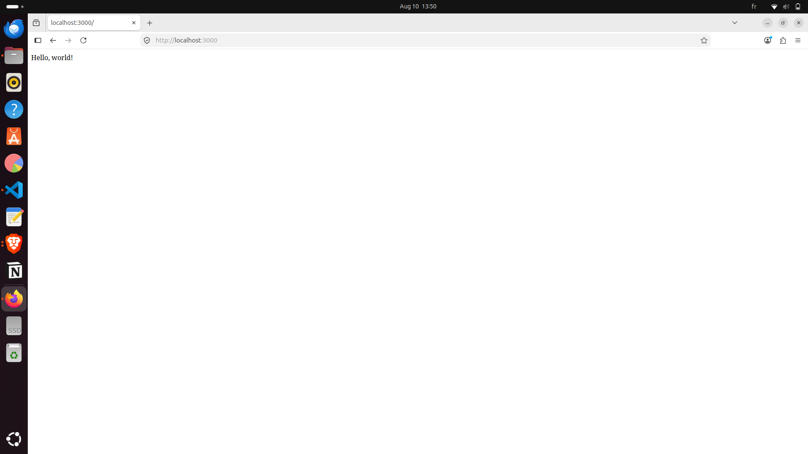

---

## 2. Basic Authentication Secret Route

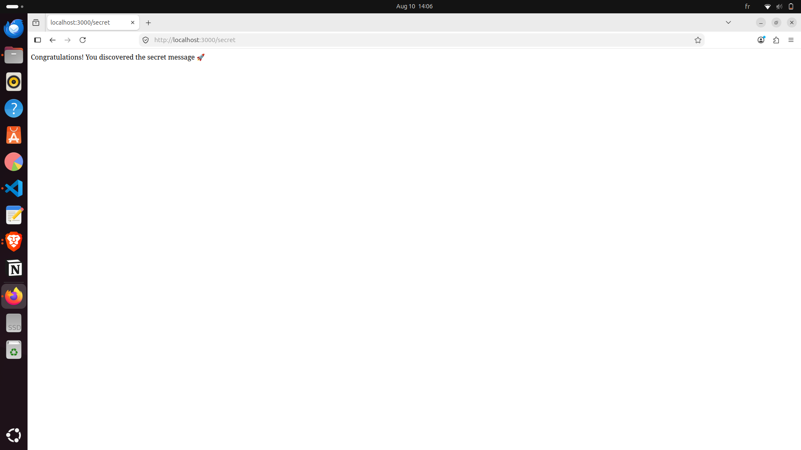

---

## 3. Docker Image Build

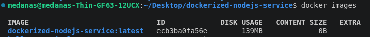

---

## 4. Docker Container Running Locally

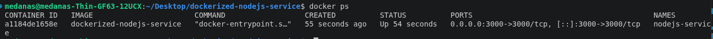

---

## 5. AWS EC2 Instance Running

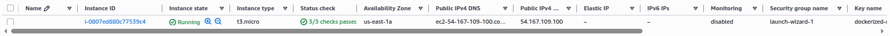

---

## 6. Successful SSH Connection

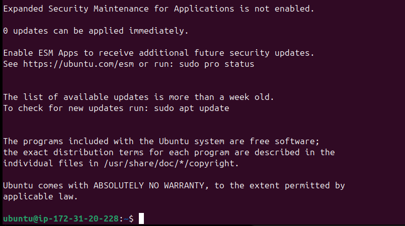

---

## 7. Docker Installed on EC2

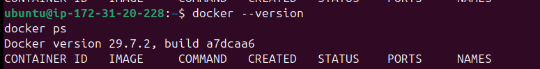

---

## 8. GitHub Actions Successful Deployment

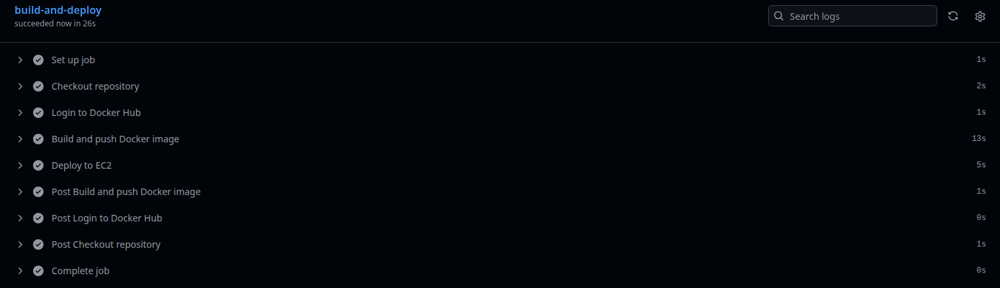

---

## 9. Docker Hub Image

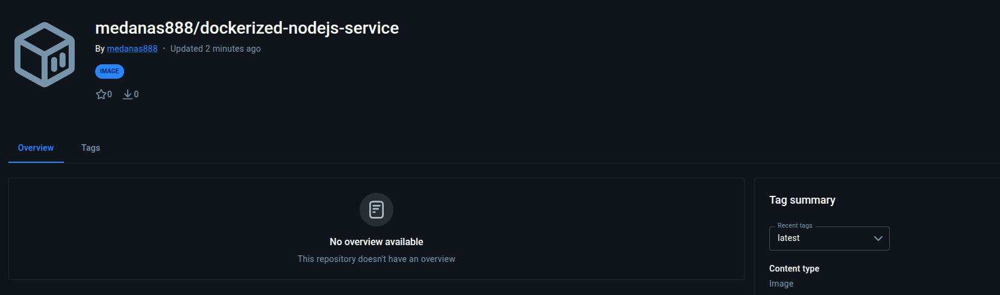

---

## 10. Docker Container Running on EC2

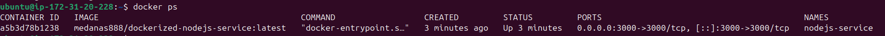

---

## 11. Application Successfully Deployed

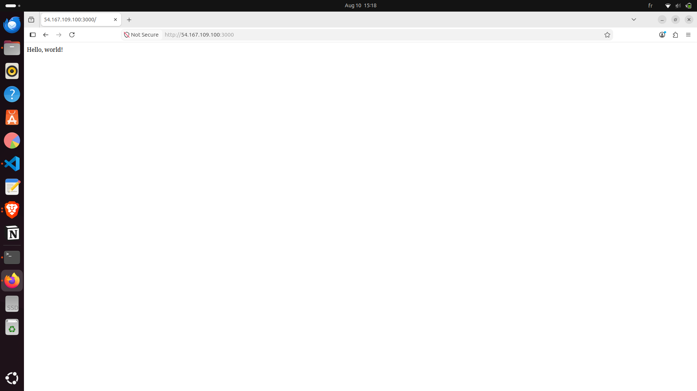

---

## 12. Protected Secret Route on EC2

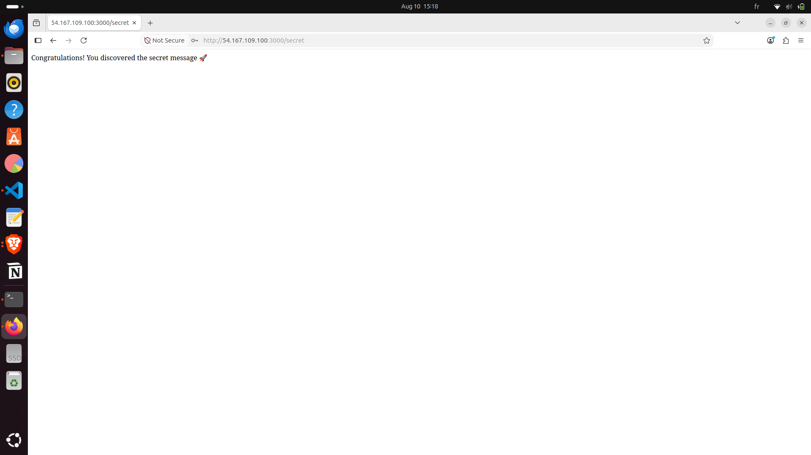

---

## 13. Automatic CI/CD Deployment

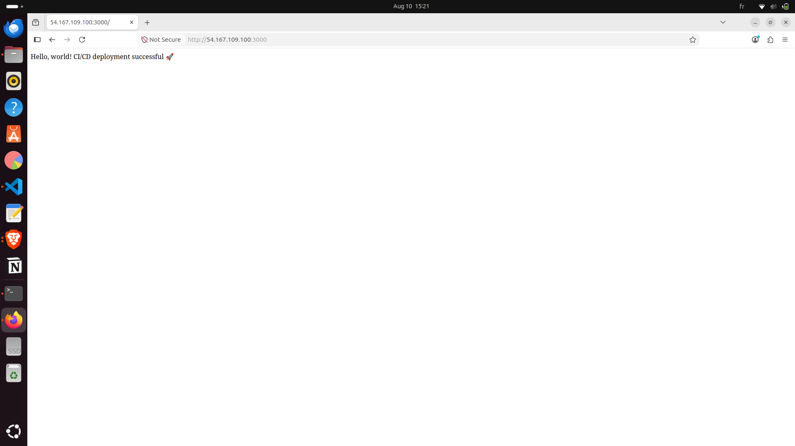

---

# 🧠 What I Learned

This project provided hands-on experience with:

- Building REST services with Node.js and Express
- HTTP Basic Authentication
- Managing environment variables
- Protecting secrets from Git
- Writing Dockerfiles
- Building Docker images
- Running and managing Docker containers
- Publishing images to Docker Hub
- Creating and configuring AWS EC2 instances
- Managing EC2 Security Groups
- Connecting to Linux servers using SSH
- Installing Docker on remote Linux servers
- Managing GitHub Actions secrets
- Creating CI/CD pipelines
- Building Docker images automatically
- Deploying containers automatically
- Updating production services after every push

---

# ✅ Final Result

The complete deployment architecture is:

```text
             Developer
                 │
                 │ git push
                 ▼
          GitHub Repository
                 │
                 ▼
           GitHub Actions
            /           \
           /             \
          ▼               ▼
   Build Image      GitHub Secrets
          │
          ▼
      Docker Hub
          │
          │ docker pull
          ▼
       AWS EC2
          │
          ▼
   Docker Container
          │
          ▼
    Node.js Service
```

The final application successfully demonstrates a fully automated Docker-based CI/CD deployment:

```text
Hello, world! CI/CD deployment successful 🚀
```

---

## 👨‍💻 Author

**Mohamed Anas Ben Mim**

DevOps / Software Engineering Project

---

## 📌 Project Status

```text
✅ Node.js Service
✅ Basic Authentication
✅ Environment Variables
✅ Dockerization
✅ Docker Hub Registry
✅ AWS EC2 Server
✅ GitHub Secrets
✅ GitHub Actions CI/CD
✅ Automatic Docker Deployment
✅ Automatic Application Updates
```